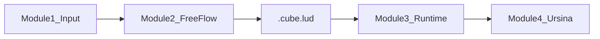

# CubeEngine Ludeme MVP

Version: `cubeengine.ludeme/0.1`  
Status: MVP implemented for Tic-Tac-Toe end-to-end

## Four-module architecture



| Module | Package | Responsibility |
|--------|---------|----------------|
| 1 Input | `srtp/source_importer.py` | Ingest runnable source projects into Source Game Package (inventory, AST evidence). Does not execute source during import. |
| 2 FreeFlow | `ludeme/freeflow.py` | Convert source evidence (+ optional design intent) into `.cube.lud`. MVP uses `TicTacToeMapper` as deterministic stand-in for local LLM. |
| 3 Runtime | `ludeme/runtime.py` | Parse and execute the Ludeme subset: legal moves, placement, Line/Full outcomes. |
| 4 Ursina | `ludeme/ursina_viewer.py` | Render board and collect clicks. All rule authority stays in Module 3. |

## Standard format

CubeEngine Ludeme is a **Ludii-inspired subset**, not Ludii JAR compatibility.

- Extension: `.cube.lud`
- Version: `(meta (format "cubeengine.ludeme/0.1"))`
- Root: `(game "Name" (players N) (equipment {...}) (rules ...))`

MVP executable subset:

- Board: `(board (rect X Y Z))`
- Play: `(move Add (to (sites Empty)))`
- End: `(if (is Line N) (result Mover Win))`, `(if (and (not (is Line N)) (is Full)) (result Draw))`

Golden fixtures:

- [`ludeme/examples/tictactoe_2d.cube.lud`](../ludeme/examples/tictactoe_2d.cube.lud)
- [`ludeme/examples/tictactoe_3x3x3.cube.lud`](../ludeme/examples/tictactoe_3x3x3.cube.lud)

## Run the pipeline

```powershell
cd C:\repos\CubeEngine-Dev
python -m ludeme.pipeline --source srtp/examples/tictactoe_2d.py --z 3 --play
```

Without `--play`, the pipeline writes `.cube.lud` under `ludeme/examples/generated/` and validates runtime readiness.

Play an existing Ludeme file directly:

```powershell
python -m ludeme.ursina_viewer --ludeme-file ludeme/examples/tictactoe_3x3x3.cube.lud
```

## Tests

```powershell
python -m unittest discover -s tests -p "test_ludeme*.py" -v
```

## Relationship to legacy SRTP / STAL / Rule IR v2

This MVP is the **new primary path** for source → standard format → generic runtime → Ursina.

Legacy packages remain parallel:

- `srtp/` — per-game adapters, Rule Schema v1, workbench
- `stal/` — XYZ topology, actions, outcomes
- `docs/CUBEENGINE_IR_V2_CONTRACT.md` — Rule IR v2 for AlphaZero and advanced runtime

The Ludeme path replaces per-game Python adapters with one declarative format and one runtime interpreter for the supported subset.

## MVP limits

- Tic-Tac-Toe only for FreeFlow mapping
- Placement on empty cells only
- No Ludii JAR, no full L-GDL
- No real LLM weights (interface ready via `FreeFlowCompiler`)

## Next steps

1. Plug local LLM into `FreeFlowCompiler`
2. Extend Ludeme subset (move, reveal, neighbourhood)
3. Add Workbench entry pointing at `python -m ludeme.pipeline`
