# CubeEngine LLM Source-to-IR Compiler Framework

Status: engineering baseline for implementation  
Version: `cubeengine.srtp/llm-compiler-framework/1.2`  
Date: 2026-08-10  
Audience: product owner, engine engineers and AI/LLM engineers

## 1. Executive decision

The LLM is a compiler front end. It is not the game runtime, renderer, random
service, input handler or training environment.

The LLM core has two first-class inputs: an immutable Source Game Package and
the user's natural-language design intent. It produces reviewable,
evidence-backed proposals for CubeEngine's four IRs:

- Rule IR;
- Scene IR;
- Asset IR;
- Input IR.

It first reconstructs a source-equivalent 2D project. Only after that project
passes source-fidelity gates may it propose a separate target 3D project and a
Spatial Lift Plan. All executable behavior remains owned by the deterministic
non-LLM core.

Source facts and user intent are never merged into one unverifiable story.
Source IR records what the original game demonstrably does; a versioned Design
Intent records what the user wants changed; target IR records the accepted 3D
result.

The compiler succeeds only when a proposal can be validated, compiled, played,
replayed and inspected. Returning valid-looking JSON is not success.

### 1.1 MVP model decision

CubeEngine will not call GPT or another hosted AI API. The MVP uses one
self-hosted open-source pretrained model, fine-tuned locally with LoRA, QLoRA
or an equivalent parameter-efficient method on CubeEngine examples. The model
source alone is insufficient: implementation requires compatible pretrained
weights and a license permitting the intended use, modification and
distribution.

The one-week MVP does not pretrain a foundation model, build a multi-provider
platform or create a large distributed training system. It builds one thin
source-to-IR-to-runtime path on the existing non-LLM core. This changes the
model implementation, not the Technical Framework or any existing Runtime
capability.

## 2. Product objective

Given a previously unseen but eligible grid-based source game, CubeEngine must
be able to:

1. preserve the immutable source project and its hashes;
2. explain what evidence supports each reconstructed mechanic;
3. reconstruct a playable source-equivalent project in the four IRs;
4. expose uncertainties instead of inventing defaults;
5. accept natural-language transformation goals before or after source analysis;
6. compile those goals into structured, reviewable Design Intent;
7. propose one or more explicit 3D spatial interpretations;
8. let the designer review and revise those interpretations conversationally;
9. compile an accepted target through the same deterministic engine path;
10. produce replay, fidelity, presentation and optional AI conformance evidence.

The minimum product invariant is:

> With target Z equal to one and no approved rule changes, legal actions, state
> transitions, outcomes, controls and presentation roles must agree with the
> proven source behavior.

## 3. Non-goals

The first compiler release does not promise:

- foundation-model pretraining from raw text;
- hosted API integration or multi-provider routing;
- arbitrary programming-language understanding;
- perfect recovery from obfuscated, networked or proprietary runtimes;
- automatic execution of untrusted generated code;
- a unique 3D answer when several designs are equally faithful;
- AlphaZero compatibility for every game;
- visual similarity without source assets or an approved substitution;
- silent fallback to a generic cube game.

Unsupported or ambiguous semantics become typed blockers, extension proposals
or designer questions.

## 4. System position

The following end-to-end chain is the product architecture. The LLM work in
this document fills its missing open-ended understanding and design stages; it
does not replace, fork or bypass the downstream deterministic stages.

```text
Source game evidence
→ LLM compiler plus user Design Intent
→ Rule / Scene / Asset / Input IR proposals
→ Schema + semantics + provenance + unresolved validation
→ Sealed Project Manifest
→ Input → Rule Runtime → Event/Time/RNG → Scene projection
→ Editor / Ursina / Renderer
→ AlphaZero nine-API compiler when eligible
```



```mermaid
flowchart LR
    A["Immutable source project"] --> B["Function 1 importer"]
    B --> C["Source Game Package"]
    C --> D["Evidence Index and Claim Ledger"]
    U["User natural-language intent"] --> V["Design Intent Compiler"]
    V --> W["Versioned Design Intent"]
    D --> E["LLM Source Compiler"]
    E --> F["Source four-IR patch proposal"]
    F --> G["Deterministic validators and compilers"]
    G --> H["Source-equivalent Project Session"]
    H --> I["Z=1 fidelity and designer review"]
    I --> J["LLM Spatial Lift Planner"]
    W --> J
    J --> K["Target four-IR patch proposal"]
    K --> Q["Schema, semantics, provenance and unresolved validation"]
    Q --> P["Sealed target Project Manifest"]
    P --> L["Input → Rule Runtime → Event/Time/RNG → Scene projection"]
    L --> N["Editor / Ursina / Renderer"]
    P --> Z["AlphaZero nine-API compiler when eligible"]
    L --> M["Non-LLM Integration Gate"]
    M --> N
    N --> U

    E --> X["Extension proposal"]
    X --> Y["Extension SDK review and sandbox gate"]
    Y --> G
```

## 5. Authoritative responsibility split

### 5.1 The LLM may

- classify source files, subsystems and semantic roles;
- connect evidence across functions, modules, data files and assets;
- propose state, action, event, outcome, presentation and input semantics;
- propose JSON Patch transactions against the four IRs;
- propose competing Spatial Lift Plans and explain trade-offs;
- compile user language into a separate structured Design Intent;
- propose conversational revisions against an exact target revision;
- propose Extension contracts, implementation and tests;
- generate clarification questions and acceptance tests;
- summarize deterministic diagnostics for a designer.

### 5.2 The LLM must not

- modify the source project;
- execute gameplay decisions live;
- bypass Rule legality or write Rule state from Input or Scene;
- invent a source citation;
- call arbitrary source code outside the supervised probe boundary;
- apply its own proposal;
- rewrite proven source facts to make them agree with a user-requested change;
- approve its own generated Extension;
- weaken a validator after a proposal fails;
- coerce an ineligible game into AlphaZero General.

### 5.3 The deterministic core owns

- inventory, byte hashes and immutable source identity;
- schemas, semantic checks, capability checks and exact versions;
- patch revision and stale-base rejection;
- Rule state, legality, transitions, outcomes, time and randomness;
- Scene projection, Asset verification and Input conflict resolution;
- Extension permissions, process lifecycle and conformance;
- replay, differential tests and final gate decisions;
- AlphaZero nine-API execution.

The full chain remains one working system. A proposal that cannot continue
through Project Manifest, Runtime, Scene projection and the applicable AI gate
is not a successful LLM conversion.

## 6. Compiler inputs

Source analysis begins with
`cubeengine.srtp/source-project-llm-handoff-v2`. It contains:

- source root and entry point;
- runtime and dependency evidence;
- immutable file and asset inventory;
- license metadata;
- static-analysis coverage;
- source-backed parameters;
- partial legacy Rule Schema evidence;
- diagnostics and unresolved semantics;
- preliminary transformation gaps;
- mandatory acceptance gates.

Directed conversion additionally accepts an initial natural-language turn.
Conversational conversion accepts the sealed source manifest, exact current
target manifest revision/hash, prior Design Intent/decision history and the new
user turn. An automatic conversion job has no initial user turn and records an
explicit `automatic_source_preserving` policy instead of fabricating one.

The LLM does not receive unrestricted filesystem access. An Evidence Service
retrieves bounded source spans and artifacts by immutable ID.

### 6.1 Required immutable identifiers

Every job records:

- `source_package_hash`;
- per-file SHA-256;
- repository/import revision;
- importer version;
- schema and capability versions;
- prompt-template version;
- retrieval-index version;
- base-model repository, license, exact weight hash and tokenizer hash;
- fine-tune dataset hash, training configuration and adapter/checkpoint hash;
- tool versions and deterministic validator versions.

Re-running a job with an unchanged manifest must be reproducible at the
artifact and validation level even if natural-language wording varies.

## 7. Evidence architecture

### 7.1 Evidence Index

Function 1 output is enriched into a content-addressed index with these node
kinds:

- source file;
- AST declaration;
- call-site and call edge;
- constant and structured literal;
- state write and state read;
- event/input handler;
- render call and presentation role;
- asset and license record;
- runtime trace event;
- screenshot/frame observation;
- documentation statement;
- diagnostic and unresolved field.

Edges include `calls`, `reads`, `writes`, `emits`, `handles`, `renders`,
`loads_asset`, `guards`, `initializes`, `terminates`, `contradicts` and
`supports`.

### 7.2 Evidence reference

Every material semantic claim must cite an immutable evidence reference:

```json
{
  "evidence_id": "ev:sha256:...",
  "source_file_hash": "...",
  "path": "src/game.py",
  "span": {"start_line": 120, "start_column": 4, "end_line": 137, "end_column": 28},
  "kind": "ast_and_runtime_trace",
  "supports": "/actions/0/effects",
  "confidence": 0.96
}
```

Line numbers are navigation aids; file hash plus byte/span identity is the
authority.

### 7.3 Evidence precedence

When evidence conflicts, the compiler does not average it. It records the
conflict and applies this default review order:

1. deterministic runtime traces from the exact source revision;
2. executable code paths reachable from the entry point;
3. structured data loaded by those paths;
4. tests and assertions;
5. official source documentation included in the project;
6. comments, names and heuristics.

Lower-priority evidence may clarify intent but cannot silently override proven
runtime behavior.

### 7.4 Source text is untrusted

README text, comments, string literals, filenames, asset metadata and source
data may contain prompt injection. They are quoted as evidence and never placed
in the system/developer instruction channel. The model receives an explicit
instruction that source content is data, not authority.

## 8. Claim Ledger

The compiler maintains one machine-readable ledger of semantic claims. A claim
is smaller than a whole IR document and has:

- stable claim ID;
- target IR JSON Pointer;
- proposed value or operation;
- supporting and contradicting evidence IDs;
- inference method;
- confidence;
- assumptions;
- alternatives;
- required capability;
- verification status;
- designer decision, if any.

States are:

```text
unexamined → proposed → evidence_checked → validator_checked
           → runtime_checked → designer_accepted → applied
                       ↘ blocked / contradicted / superseded
```

Confidence is never permission to apply. A high-confidence claim without a
valid evidence reference is rejected.

## 9. Natural-language transformation interface

Natural language is a primary product interface to conversion, not merely a
fallback clarification channel. It allows a non-programmer to state a desired
3D result, inspect the compiled interpretation and revise it conversationally.
It never becomes executable gameplay text.

### 9.1 Three product modes

**Automatic conversion**

The user uploads a source project without additional instructions. The engine
reconstructs the source game, proposes the most conservative source-preserving
3D alternatives and asks only questions that materially affect the result.

```text
source upload
→ source evidence and source four IRs
→ conservative Spatial Lift alternatives
→ required clarification or designer selection
→ validated target four IRs
```

**Directed conversion**

The user uploads a source project and supplies a transformation instruction,
for example:

> Preserve the original 8×8 board and artwork, add three Z layers, and allow
> captures across layers.

The instruction may arrive before source analysis finishes, but it is stored
separately and is not allowed to alter the reconstruction of source facts.

```text
source evidence → source four IRs ┐
                                  ├→ Spatial Lift Planner → target patches
user language → Design Intent ────┘
```

**Conversational iteration**

After a target is playable, the user may request changes such as “make Z five
layers”, “vertical lines do not win”, “keep the pieces but make the board
transparent” or “the second layer is reachable only through a portal”. Each
turn becomes a new Design Intent revision and a proposed four-IR Patch
transaction against the exact current target hash.

### 9.2 Three authorities must remain distinct

| Authority | Meaning | May be changed by ordinary user prompt? |
|---|---|---:|
| Source evidence / Source IR | What the imported original demonstrably does | No |
| Design Intent | What the user asks the target to preserve, add, remove or reinterpret | Yes, revisioned |
| Target IR | The accepted executable result of source facts plus approved design choices | Only through validated Patch |

If source evidence proves that the original Snake collides with walls and the
user asks for wraparound movement, Source IR still records wall collision. The
target Rule IR receives the approved wraparound Patch, and source/target
lineage preserves the difference.

Precedence is:

1. immutable source evidence defines source truth;
2. explicit current user instruction defines target design intent;
3. accepted designer decisions resolve ambiguity;
4. engine capability and safety constraints determine what can execute;
5. model recommendations have no authority until accepted.

When a request conflicts with an invariant, license, capability, prior locked
decision or another active intent, the compiler reports the conflict and asks
for a bounded decision. It does not silently choose one.

### 9.3 Design Intent Contract

Every natural-language turn is preserved verbatim and compiled to a versioned
structured artifact before any four-IR Patch is generated:

```json
{
  "intent_version": "cubeengine.srtp/design-intent/1.0",
  "intent_id": "intent:...",
  "conversation_id": "conversation:...",
  "turn_id": "turn:...",
  "project_id": "project:...",
  "source_manifest_hash": "...",
  "target_base": {
    "project_id": "project:...",
    "revision": 3,
    "content_hash": "..."
  },
  "original_text": "Preserve X/Y, add three Z layers and allow cross-layer capture.",
  "language": "en",
  "operation": "transform",
  "scope": ["rule", "scene", "asset", "input"],
  "preserve": [
    {"subject": "source.topology.x_y", "strength": "required"},
    {"subject": "source.presentation.roles", "strength": "preferred"}
  ],
  "changes": [
    {"subject": "target.topology.z", "operator": "set", "value": 3},
    {"subject": "target.capture", "operator": "extend", "value": "cross_layer"}
  ],
  "constraints": [],
  "resolved_references": [],
  "assumptions": [],
  "conflicts": [],
  "unresolved": [],
  "requires_confirmation": true,
  "status": "proposed"
}
```

Required properties include:

- exact original text and language;
- source and target base hashes;
- operation: create, transform, revise, explain, compare, undo or resolve;
- affected Rule/Scene/Asset/Input scopes;
- preservation requirements and allowed changes;
- parsed values, units, topology references and participant references;
- assumptions, conflicts and unresolved references;
- confirmation and application status;
- provenance identifying the user or approved automation policy.

The Design Intent Compiler may normalize synonyms and resolve references such
as “the second layer”, but it may not invent a missing numeric value or replace
an ambiguous object reference without recording an unresolved item.

### 9.4 Natural-language turn lifecycle

```text
received
→ safety_classified
→ context_resolved
→ structured_intent_proposed
→ ambiguity_or_conflict_check
→ designer_confirmation when required
→ four-IR patches proposed
→ deterministic validation and preview
→ accepted | rejected | revised | superseded
```

Every turn is auditable and reversible. A later instruction does not edit the
history of an earlier one; it supersedes or negates it through another
transaction. “Undo that change” resolves to a known decision/patch ID rather
than asking the model to reconstruct history from chat text.

### 9.5 Preview and feedback requirements

Before application, Workbench must show:

- the original user instruction;
- the normalized Design Intent;
- source-preserved and target-changed behaviors;
- exact four-IR diff;
- conflicts, assumptions and unanswered questions;
- expected effects on legal actions, outcomes, presentation and controls;
- Z=1 fidelity and Z>1 property-test results;
- AlphaZero eligibility changes;
- a playable temporary Project Session when compilation succeeds.

Natural language therefore enters the same Technical Framework as automatic
source understanding. It does not create an alternate “chat runtime”.

## 10. Required output contracts

### 10.1 LLM Proposal v2

The authoritative response envelope is strict JSON:

```json
{
  "proposal_version": "cubeengine.srtp/llm-proposal/2.0",
  "proposal_id": "proposal:...",
  "job_id": "job:...",
  "stage": "source_rule_semantics",
  "source_package_hash": "...",
  "design_intent": null,
  "base_documents": {
    "rule_ir": {"document_id": "...", "revision": 0, "content_hash": "..."},
    "scene_ir": {"document_id": "...", "revision": 0, "content_hash": "..."},
    "asset_ir": {"document_id": "...", "revision": 0, "content_hash": "..."},
    "input_ir": {"document_id": "...", "revision": 0, "content_hash": "..."}
  },
  "patches": {
    "rule_ir": [],
    "scene_ir": [],
    "asset_ir": [],
    "input_ir": []
  },
  "claims": [],
  "tests": [],
  "extension_proposals": [],
  "spatial_lift_options": [],
  "assumptions": [],
  "unresolved": [],
  "clarification_questions": []
}
```

The LLM never returns complete replacement documents when a patch can express
the change. Every patch pins the exact base revision and hash and is applied by
the corresponding deterministic RFC 6902 transaction endpoint.

`design_intent` is null during source-truth reconstruction. Target and
conversational proposals pin the exact accepted Design Intent ID, revision and
hash, so a four-IR change is always traceable to the user's instruction.

### 10.2 Clarification request

A designer question must contain:

- the exact unresolved IR path;
- why source evidence is insufficient or contradictory;
- two or more concrete alternatives when known;
- behavioral consequences for source fidelity and 3D play;
- the recommended option and why;
- whether the decision is reversible;
- screenshots or trace links when useful.

Questions such as “What are the rules?” are rejected as insufficiently scoped.

### 10.3 Spatial Lift Plan

Spatial conversion is a separate reviewed artifact, not a hidden prompt step.
Each plan covers:

- topology and anchor: cell, vertex, edge, graph or hybrid;
- source X/Y policy and target Z extent;
- logical-to-world axis mapping;
- neighborhood kernel;
- movement and gravity;
- spawn and distribution;
- collision, pathfinding and line-of-sight;
- action catalogue consequences;
- outcome and scoring consequences;
- entity and state initialization;
- presentation mapping and occlusion;
- input conflicts and camera controls;
- AI state/action consequences;
- Z=1 equivalence tests;
- Z>1 property tests;
- alternatives requiring designer approval.

The plan produces patches for all affected IRs. Changing only the topology
extent while leaving actions or outcomes inconsistent is a compile blocker.

### 10.4 Extension proposal

When the declared engine capabilities cannot express a proven mechanic, the
compiler may propose an Extension package containing:

- capability ID and version;
- exact typed request/response schemas;
- determinism, purity and replay declarations;
- minimal permissions;
- implementation source;
- package byte inventory and expected hash;
- unit, mutation, timeout and fresh-process determinism tests;
- reason the declarative core is insufficient.

Generated code remains untrusted and cannot be approved by the model that
generated it.

## 11. Compiler pipeline

### Stage 0 — Intake and preflight

- validate the Source Game Package;
- verify all file hashes and source immutability;
- classify runtime/framework and eligible probes;
- detect unsupported binaries, native modules or missing dependencies;
- preserve any initial user instruction as an immutable, unexecuted intent turn;
- create a content-addressed job.

Exit: valid immutable job manifest or explicit intake failure.

### Stage 1 — Evidence indexing

- parse AST and structured data without executing top-level source;
- construct call/state/event/render/asset graph;
- attach existing Function 1 diagnostics;
- identify candidate subsystems and retrieval scopes.

Exit: queryable Evidence Index plus coverage map.

### Stage 2 — Source behavior decomposition

The orchestrator asks bounded questions in dependency order:

1. topology and coordinate model;
2. state and entity lifecycle;
3. participants and information model;
4. input semantics and action catalogue;
5. legality and effects;
6. events, time and randomness;
7. goals, score and terminal outcomes;
8. modes and parameters;
9. presentation roles and feedback.

Each task retrieves only relevant evidence and emits claims, not a whole game.

Exit: Claim Ledger with explicit unresolved and conflicts.

### Stage 3 — Source four-IR proposal

- assemble typed source IR patches from accepted claims;
- generate provenance entries for every material field;
- emit required unresolved entries rather than guesses;
- propose Extension requirements where necessary.

Exit: structurally valid proposal envelope.

### Stage 4 — Deterministic validation loop

For each patch transaction:

1. validate response schema;
2. check evidence references against the immutable index;
3. reject stale base revisions/hashes;
4. apply to a temporary branch;
5. run IR semantic validator and capability diagnostics;
6. return bounded diagnostics to the model for one repair proposal;
7. preserve every failed attempt for audit.

The model may repair its proposal; it may not edit validators or erase
diagnostics.

Exit: compile-ready source Project or targeted clarification blockers.

### Stage 5 — Source runtime probes and fidelity

- run the original project under the supervised source runner where allowed;
- capture normalized input/action/state/outcome traces;
- execute equivalent traces through the source Project Session;
- compare legal actions, state projections, outcomes and visible feedback;
- add differential failures to the Claim Ledger.

Exit: source-equivalent project accepted, or unresolved source mismatch.

### Stage 6 — Designer source review

Workbench shows source evidence, IR diff, trace comparison, assumptions and
unresolved items. Applying accepted patches creates a sealed source variant;
the original project remains untouched.

Exit: designer-approved source Project Manifest.

### Stage 7 — Design Intent resolution

- select automatic, directed or conversational mode;
- compile the current user turn into the Design Intent Contract;
- resolve references against the accepted source and current target revision;
- separate source-preservation constraints from requested target changes;
- detect conflicts, missing values and material ambiguity;
- obtain designer confirmation when the proposed interpretation is not safely
  reversible or materially changes gameplay.

Exit: one sealed, reviewable Design Intent or explicit clarification blockers.

### Stage 8 — Spatial Lift alternatives

- identify every spatially coupled claim;
- combine the accepted source Project with the sealed Design Intent;
- generate conservative source-preserving and optional creative alternatives;
- run completeness and internal-consistency checks;
- ask only material designer questions;
- generate target four-IR patches against a separate target variant.

Exit: one accepted Spatial Lift Plan with no required unresolved fields.

### Stage 9 — Target compilation and tests

- compile Rule, Asset, Scene and Input in dependency order;
- validate source→target manifest lineage;
- run Z=1 differential tests;
- run Z>1 legality, transition, outcome, presentation and input tests;
- run replay and deterministic random checks;
- assess Extension and optional AlphaZero eligibility.

Exit: compile-ready target or actionable blockers.

### Stage 10 — Final Integration Gate

Run the sealed Non-LLM Integration Gate across source, target, extensions,
replay, Scene projection and eligible AI output. Only `passed: true` may create
a releasable target project.

## 12. Orchestration design

The compiler is a resumable job system, not one long chat completion. The
services below are logical responsibilities. In the one-week MVP they remain
small modules inside one local process; they are not microservices.

### 12.1 Core services

| Service | Responsibility |
|---|---|
| Job Service | immutable job manifest, state machine, cancellation and resume |
| Evidence Service | index, bounded retrieval and citation verification |
| Design Intent Service | natural-language turns, structured intents, conflicts, revisions and undo targets |
| Prompt Registry | versioned system/task templates and response schemas |
| Local Model Runtime | load the approved local checkpoint, run bounded inference and record model/training identity |
| Proposal Service | immutable proposal attempts and Claim Ledger |
| Validation Service | schema, semantics, capability and patch checks |
| Probe Service | supervised original runtime traces and screenshots |
| Extension Service | generated package review and sandbox conformance |
| Evaluation Service | golden corpus, regression and mutation tests |
| Workbench Bridge | progress, diffs, questions, decisions and preview sessions |

### 12.2 Job state machine

```text
created
→ preflight
→ indexing
→ source_analysis
→ source_validation
→ clarification_required | source_review
→ source_accepted
→ intent_received
→ intent_resolution
→ intent_confirmation_required | intent_accepted
→ spatial_lift_analysis
→ target_validation
→ target_review
→ integration_gate
→ completed

After target_review or completed, a new conversational turn returns to
intent_received against the exact current target revision.

Any stage may enter failed, cancelled or blocked without losing artifacts.
```

### 12.3 Idempotency and caching

Every expensive operation is keyed by the hashes of:

- source package;
- sealed Design Intent revision when the task is target-facing;
- requested analysis scope;
- retrieved evidence set;
- prompt template;
- response schema;
- model configuration;
- compiler capability manifest.

Cached model output is never trusted without rerunning current deterministic
validation.

## 13. Model task design

The complete product may use several narrow model tasks rather than one
“convert this repository” call. The one-week MVP collapses these into only two
bounded tasks: source evidence to four-IR patches, and Source IR plus Design
Intent to Spatial Lift patches.

Recommended task classes:

- subsystem classifier;
- state-write and transition analyst;
- input/action analyst;
- outcome analyst;
- presentation/asset-role analyst;
- contradiction resolver;
- natural-language Design Intent compiler;
- intent reference/conflict resolver;
- conversational revision and undo planner;
- IR patch author;
- Spatial Lift option author;
- test author;
- diagnostic repair author;
- designer explanation author.

Each task receives:

- one explicit objective;
- relevant IR schema fragments and capability profile;
- a bounded evidence pack;
- known claims and conflicts;
- strict output schema;
- an instruction to abstain when evidence is insufficient.

It does not receive secrets, unrelated private files, prior model chain of
thought or executable tool authority.

## 14. Local model and training policy

The MVP loads one approved open-source pretrained model and its tokenizer on
CubeEngine-controlled hardware. There is no hosted-model API and no
multi-provider abstraction in the one-week scope.

Required behavior:

- record the base repository/revision, license, weight hash and tokenizer hash;
- keep the selected base weights immutable;
- store the fine-tune dataset, configuration, seed and adapter/checkpoint hash;
- use LoRA, QLoRA or another small parameter-efficient fine-tune rather than
  foundation pretraining;
- run inference behind one narrow `LocalModelRuntime` interface so the chosen
  model can be replaced later without changing IR contracts;
- require strict structured output followed by deterministic schema validation;
- record request ID, checkpoint ID, prompt version, evidence pack and latency;
- bound generation length, time and repair attempts;
- keep source projects and training data local;
- reject checkpoints or datasets with missing license/provenance records.

The MVP may use prompt examples before the fine-tune is ready, but acceptance
requires at least one reproducible CubeEngine parameter-efficient fine-tune and
an evaluation against the unchanged base checkpoint.

Reasoning text is not an artifact of record. Claims, citations, patches,
assumptions, tests and diagnostics are.

## 15. Deterministic repair loop

Diagnostics returned to the model use stable codes and paths:

```json
{
  "attempt": 2,
  "base_hash": "...",
  "diagnostics": [
    {
      "code": "rule.expression.type",
      "path": "/actions/1/precondition",
      "message": "Expected core:bool; inferred core:int",
      "capability": "cubeengine.rule-runtime/2.0-alpha.2"
    }
  ],
  "allowed_result": "replacement_patch_only"
}
```

Default maximum automatic repairs: two per bounded proposal. Repeated failure
becomes a blocker or designer/engineer task; it does not trigger an unbounded
self-editing loop.

## 16. Designer approval policy

Auto-application is not permitted for the first release.

Workbench approval units are small, reversible transactions. The designer sees:

- source and target behavior side by side;
- exact four-IR diff;
- supporting evidence and contradictions;
- source/runtime trace comparison;
- assumptions and unresolved items;
- affected legal actions, outcomes and presentation roles;
- generated tests and results;
- extension/security implications;
- rollback point.

A model recommendation is visually distinct from proven source evidence and a
designer decision.

## 17. Security model

### 17.1 Threats

- prompt injection in source/comments/assets;
- secret exfiltration through prompts or generated code;
- path traversal and symlink escape;
- generated network/process/filesystem calls;
- denial of service through huge repositories or recursive analysis;
- native extension loading;
- stale proposal application;
- citation spoofing;
- model output that weakens tests or capabilities.

### 17.2 Controls

- source mounted/read as immutable data;
- content-addressed paths and root containment checks;
- bounded file size, repository size and retrieval size;
- parser and probe processes separated;
- network denied to generated code;
- exact allowlisted SDK imports;
- Extension package hashing and human approval;
- external OS sandbox required for untrusted code;
- all patches applied to new variants;
- evidence references verified outside the model;
- final deterministic Integration Gate cannot be overridden by model output.

## 18. Observability and progress

Progress events describe real work units:

```json
{
  "job_id": "job:...",
  "sequence": 42,
  "stage": "source_rule_semantics",
  "status": "running",
  "completed_units": 6,
  "total_units": 9,
  "current_scope": "goals_and_outcomes",
  "artifact_ids": ["proposal:..."],
  "warnings": []
}
```

Required telemetry:

- stage duration and queue time;
- local inference calls, tokens, latency, memory use and retry reason;
- training run, dataset, seed, checkpoint and validation loss/metrics;
- retrieved evidence count and bytes;
- citation verification rate;
- validation diagnostics by stable code;
- repair attempts;
- clarification count and response time;
- Design Intent parse/confirmation/correction count;
- conversational revision compile and rollback result;
- designer corrections;
- compile, replay and gate result;
- source-project modification count, expected to remain zero.

## 19. Service interface

Minimum API surface:

```text
POST   /v1/analysis-jobs
GET    /v1/analysis-jobs/{job_id}
POST   /v1/analysis-jobs/{job_id}/cancel
GET    /v1/analysis-jobs/{job_id}/events
GET    /v1/analysis-jobs/{job_id}/artifacts
POST   /v1/conversations
POST   /v1/conversations/{conversation_id}/turns
GET    /v1/design-intents/{intent_id}
POST   /v1/design-intents/{intent_id}/confirm
POST   /v1/projects/{project_id}/design-intents
GET    /v1/proposals/{proposal_id}
POST   /v1/proposals/{proposal_id}/validate
POST   /v1/proposals/{proposal_id}/clarifications
POST   /v1/proposals/{proposal_id}/approve
POST   /v1/proposals/{proposal_id}/apply
POST   /v1/projects/{project_id}/compile
POST   /v1/projects/{project_id}/integration-gate
```

Mutating endpoints require idempotency keys and exact base hashes. Proposal
approval and application are separate operations.

## 20. Storage layout

Artifacts are immutable and content-addressed:

```text
jobs/{job_id}/job.json
jobs/{job_id}/events.jsonl
evidence/{source_package_hash}/index.json
evidence/{source_package_hash}/objects/{sha256}
claims/{job_id}/ledger.json
conversations/{conversation_id}/turns.jsonl
intents/{intent_id}/intent.json
intents/{intent_id}/validation.json
proposals/{proposal_id}/proposal.json
proposals/{proposal_id}/validation.json
decisions/{decision_id}.json
projects/{project_id}/revisions/{revision}/
evaluations/{evaluation_id}/report.json
```

Raw model responses may be retained in a restricted audit store according
to project policy; they are never executable artifacts.

## 21. Evaluation framework

### 21.1 Golden corpus

Initial families:

- placement/connection;
- merge (2048);
- reveal/mark/neighborhood (Minesweeper);
- tick movement (Snake);
- capture/flip (Othello);
- fall/rotate/clear (Tetris);
- move/push/goal (Sokoban).

Each project requires licensed source, a runnable smoke test, reviewed source
four IRs, accepted spatial alternatives, evidence truth, traces, expected
clarifications and adversarial evidence cases.

Repository-level train/development/test separation is mandatory. Files from one
project may not be split across evaluation partitions.

### 21.2 Primary metrics

- semantic claim precision/recall;
- unsupported applied claim rate, target zero;
- citation validity and span accuracy;
- appropriate abstention rate;
- schema and semantic validation rate;
- source four-IR compile rate;
- Z=1 legal-action/next-state/outcome agreement;
- deterministic replay rate;
- presentation-role and input-feedback coverage;
- designer correction count and time;
- Design Intent field accuracy and reference-resolution accuracy;
- natural-language conflict detection and appropriate clarification rate;
- conversational change compile, replay and rollback success rate;
- source-truth mutation rate caused by target instructions, target zero;
- Extension generation/conformance rate;
- target Integration Gate pass rate;
- local inference latency and peak memory per accepted project.

### 21.3 Required negative cases

- prompt injection in README/comments/assets;
- conflicting code and documentation;
- dead/unreachable rule code;
- missing assets and dependencies;
- dynamic imports and reflection;
- nondeterministic wall clock and random calls;
- changed source after proposal generation;
- invalid or partial structured output;
- unsupported Extension permissions;
- games outside current Runtime or AlphaZero capabilities.

## 22. Release gates

### 22.1 Source Project gate

- source package hash verified;
- four IR schemas and semantic validators pass;
- all applied claims have verified evidence or designer input;
- required unresolved count is zero;
- source Project Manifest is sealed;
- supervised source and Project Session traces agree for required scenarios;
- source remains unmodified;
- designer approves the source reconstruction.

### 22.2 Target 3D gate

- target manifest pins the exact source manifest;
- every target change traces to a sealed Design Intent, accepted Spatial Lift
  Plan, source-preserving automatic policy or explicit designer decision;
- natural-language intent conflicts and required unresolved references are zero;
- Spatial Lift Plan covers every affected dimension;
- Z=1 differential tests pass;
- Z>1 legality, transition, outcome and presentation properties pass;
- input conflicts are resolved;
- assets are traceable or substitutions are approved;
- required Extensions pass their security/conformance gates;
- deterministic replay passes;
- final Non-LLM Integration Gate reports `passed: true`;
- designer approves the target variant.

## 23. One-week MVP implementation

The complete architecture remains the product direction, but it is not the
one-week backlog. The MVP implements one vertical slice and reuses every
existing non-LLM component. It has four small packages.

### MVP-1 — Contracts plus local model boot

- minimal schemas for Evidence Reference, Proposal v2, Design Intent and
  Spatial Lift Plan;
- one filesystem job folder and ordered progress log;
- one `LocalModelRuntime` that loads the chosen pretrained weights locally;
- strict JSON output and fail-closed validation;
- base-model/weight/tokenizer/license identity record.

Exit: a frozen request and one local model request produce a stored,
schema-validated artifact without any external API call.

### MVP-2 — Small evidence pack plus CubeEngine fine-tune

- reuse Function 1 inventory, provenance and extracted source fields;
- retrieve only relevant source spans and assets; no graph database or separate
  retrieval service;
- create a small, reviewed JSONL dataset from existing fixtures;
- run one reproducible LoRA/QLoRA fine-tune and compare it with the unchanged
  base checkpoint;
- reject unverifiable citations.

Exit: the selected local checkpoint produces better valid-contract results on
a game-level validation split and records exact dataset/configuration hashes.

### MVP-3 — Source and target proposal compiler

- one bounded prompt/task for source four-IR patches;
- one bounded task for Design Intent plus Spatial Lift patches;
- at most two diagnostic repair attempts;
- apply accepted patches through existing IR transactions;
- compile source and target Project Sessions through the existing Runtime;
- return `unresolved` when evidence or capability is insufficient.

Exit: one supported source project compiles into a playable source-equivalent
session, accepts one natural-language Z-axis instruction, and compiles a
playable target without a hand-written game Adapter.

### MVP-4 — Workbench acceptance and regression

- add only the Workbench controls required to select a source, enter an
  instruction, run conversion, inspect the normalized intent/diff/errors and
  launch the compiled result;
- run current validators, deterministic replay and final Integration Gate;
- test one development game and one held-out eligible game;
- record model checkpoint, prompt, evidence and output for reproduction.

Exit: the held-out game completes the visible end-to-end Technical Framework
on the target Windows environment, or stops with a clear unresolved/capability
message instead of fabricating behavior.

### Deferred until after MVP

The following do not block the one-week MVP and must not be added unless the
vertical slice is already passing:

- distributed training or model serving;
- multiple model/provider routing;
- graph databases, vector databases or microservice decomposition;
- autonomous Extension code generation/execution;
- large evaluation dashboards;
- generalized runtime-probe automation;
- multi-user accounts, remote queues and cloud deployment;
- free-form multi-turn undo beyond one revision;
- exhaustive support for every game family.

Deferral does not weaken or remove existing Rule/Scene/Asset/Input validation,
Project sealing, deterministic Runtime, replay or Integration Gate behavior.

## 24. Team responsibilities

### Product owner / game designer

- defines fidelity and acceptable creative freedom;
- defines natural-language conversion UX, confirmation policy and terminology;
- resolves material spatial alternatives;
- approves source and target variants;
- defines user-facing correction workflow and quality thresholds.

### AI/LLM engineer

- integrates the approved open-source pretrained weights and local inference runtime;
- prepares the reviewed CubeEngine dataset and reproducible LoRA/QLoRA fine-tune;
- implements bounded Evidence retrieval, Prompt Registry and thin orchestration;
- owns Design Intent parsing, reference resolution and conversational evaluation;
- owns structured-output reliability, checkpoint evaluation and local model telemetry;
- does not implement alternate gameplay semantics outside IR/Extension contracts.

### Engine engineer

- owns schemas, validators, patch transactions, compilers and Runtime capabilities;
- owns Design Intent schema/base-hash validation and its Workbench transaction boundary;
- provides stable diagnostics and capability profiles;
- owns Workbench bridge, Project Session and Integration Gate.

### Shared

- golden corpus truth;
- generated-test review;
- Extension security review;
- model/version release decisions;
- incident analysis for incorrect conversions.

## 25. Definition of done

### 25.1 One-week MVP

The MVP is accepted when one development game and one held-out eligible game
can run locally without an external AI API through:

```text
Function 1 evidence → local fine-tuned model → four-IR proposal
→ deterministic validation → source Project Session
→ natural-language Design Intent → Spatial Lift patches
→ target Project Session → Workbench → Integration Gate
```

The held-out case must use no hand-written game-specific Adapter. Required
unresolved semantics may stop compilation with a clear message; silent guessing
is a failure. Existing non-LLM tests and behavior must remain unchanged.

### 25.2 Complete product direction

The LLM Source-to-IR Compiler is not complete until an unseen eligible source
project can, without a hand-written game adapter:

1. enter as an immutable Source Game Package;
2. produce a citation-valid source four-IR proposal;
3. accept an initial or later natural-language conversion instruction;
4. compile it into a reviewable Design Intent without rewriting source facts;
5. ask correct bounded questions for genuine ambiguity or intent conflicts;
6. compile into a playable source-equivalent Project Session;
7. pass source differential and replay tests;
8. produce reviewed Spatial Lift alternatives combining Source IR and Design Intent;
9. compile the accepted target into a playable 3D Project Session;
10. apply a conversational revision and undo it through exact Patch history;
11. preserve source/target lineage and assets;
12. pass the final Non-LLM Integration Gate;
13. expose the whole process, evidence, intent, diffs and decisions in Workbench.

Until all thirteen conditions hold, the system is a proposal prototype, not an
automatic game-conversion product.

## 26. Immediate next action

Before Day 1, provide the AI engineer with one open-source pretrained model
repository, compatible weight checkpoint, tokenizer, license and target
hardware information. Then implement **MVP-1: Contracts plus local model boot**.
Do not add service infrastructure until the local model can produce one valid
artifact and the existing validators can reject one invalid artifact.
