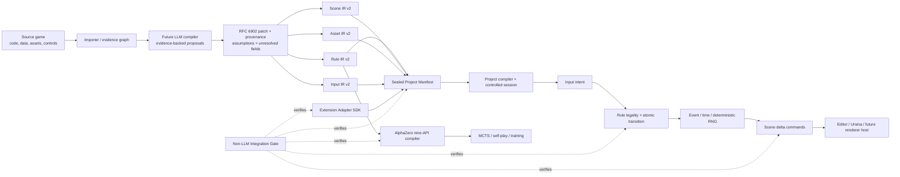

# CubeEngine 非 LLM 核心完成工作報告

狀態日期：2026-08-07  
適用對象：產品負責人、引擎工程師、AI／LLM 工程師  
結論：六項非 LLM 核心與最終整合閘門均已完成目前鎖定範圍的實作及自動驗收，LLM 階段可以開始。

## 1. 這一階段的開發目標

CubeEngine 的產品目標不是讓 LLM 為每個輸入遊戲生成一個互不相容的 Python 小遊戲，而是把來源遊戲轉譯成一組可檢查、可編輯、可執行、可重播、可呈現、可訓練的共同引擎語言。

因此本階段建立的是一個確定性的執行地基：LLM 日後負責理解陌生來源與提出轉換方案；非 LLM 核心負責判定該方案是否完整、合法、能力可用，並以一致方式執行。沒有通過這個地基的內容，不得因為 LLM 輸出看似合理而直接成為遊戲規則。

這解決了早期手寫 adapter 模式的根本問題：每個 adapter 都能證明「某一個遊戲可以被重做」，但不能證明下一個遊戲可以自動進入同一套產品流程。共同 IR 與 Runtime 把轉換工作從無限制生成程式，改為對固定合約做有證據的翻譯。

## 2. Technical Framework

### 2.1 整體架構




### 2.2 四個 IR 的權責邊界

| 合約 | 唯一負責 | 不得負責 |
|---|---|---|
| Rule IR | 權威狀態、動作、合法性、狀態轉移、事件、時間、隨機、目標與終局 | 網格材質、攝影機、滑鼠鍵碼、編輯器視角 |
| Scene IR | 場景樹、節點、Prefab、Camera、Light、Collider、Topology 視覺化與 Rule-state binding | 改寫合法性或勝負 |
| Asset IR | 來源素材、雜湊、授權、匯入設定、衍生資產與語意角色 | 遊戲中的權威狀態 |
| Input IR | 鍵鼠／觸控／手柄事件到語意 intent 或 Rule action request 的映射 | 直接修改棋盤或繞過 Rule 判定 |

Project Manifest 不是第五種內容 IR；它把四份已封存文件的 ID、版本與 SHA-256 精確鎖在一起，並保留 source → target 3D 的來源關係。Project Session 是唯一允許把 Input request 交給 Rule，再把結果投影為 Scene commands 的整合邊界。

### 2.3 一次玩家操作的執行路徑

```text
Physical input
  → Input context / focus / priority / conflict resolution
  → semantic intent or typed Rule action request
  → Rule legality check
  → one atomic state transaction
  → ordered event, time and random consequences
  → outcome and invariant checks
  → immutable replay/audit entry
  → incremental Scene projection
  → renderer-neutral commands
```

同一條路徑同時服務 Workbench、Ursina、測試器與未來其他 renderer。界面不再各自擁有一套玩法，AI 也不另寫一套勝負邏輯。

## 3. 已完成的六項非 LLM 核心

### 3.1 Rule IR v2

**負責什麼：** 用統一資料模型表示「遊戲如何玩」。它包括有型別的 parameters／modes、參與者、2D／3D topology、global／participant／topology-site／entity 四種狀態範圍、entity lifecycle、純 expression/query、動作 catalogue、合法性、原子 effects、事件與 systems、目標、終局、invariants、隨機 stream 與 extension references。

**開發目的：** 讓井字棋、Othello、掃雷、Snake 或未來新遊戲不必各自發明 state、action、legality、outcome API；也讓 LLM 只能填入已知語義或誠實標記 unresolved，不能把猜測藏進 executable code。

**關鍵成果：**

- JSON Schema、語意 validator、canonical hash 與 sealed document；
- RFC 6902 revision-safe patch transaction，拒絕 stale base；
- declared value types、四種 state scope 與完整 rollback；
- 通用 bounded-grid topology query library：direction、neighbor、ray、bracketed run、region、connectivity、stable shortest path；
- Tic-Tac-Toe 與 Othello 都由資料驅動進入同一 Runtime，Othello 沒有 game-specific runtime adapter。

Topology query library 不是第七個核心；它是 Rule IR／Runtime 為網格規則提供的通用空間查詢能力。Othello 也不是產品硬編碼，而是驗證 ray capture、flip、pass 與 scoring 能否由同一規則語言表達的 conformance fixture。

### 3.2 通用事件與時間 Runtime

**負責什麼：** 執行 Rule IR，而不是理解來源程式。它管理 action、event、tick、phase、state-change、manual trigger、排程、取消、回合、同時動作、pause／step 與 wall-clock 到 deterministic tick 的量化。

**開發目的：** 消除「每個遊戲自己寫 update loop」造成的順序差異、不可重播、不同 FPS 結果不同及 AI／GUI 規則分裂。

**關鍵成果：** phase → priority → stable ID 的固定排序；整個 event cascade 是一個可回滾交易；integer-nanosecond real-time bridge；bounded catch-up；runtime fork 讓 MCTS 能快速建立互不污染的分支；完整 replay trace 與 divergence detection。

### 3.3 確定性隨機服務

**負責什麼：** 提供所有會影響權威狀態的隨機結果。

**開發目的：** 讓「同 seed、同輸入」得到同狀態，使 bug、存檔、測試與 self-play dataset 可以重現；不允許規則在任意位置私自呼叫系統亂數。

**關鍵成果：** versioned PCG32 與 recorded-result algorithm；fixed／session／external／recorded 四種 seed policy；六種明確 distribution；chance result audit；RNG snapshot／restore；RNG 狀態納入 authoritative state hash；固定 conformance vectors。

### 3.4 Scene／Asset／Input Compilers 與 Project Manifest

**Scene Compiler 負責：** 把 Scene IR 編譯為 renderer-neutral hierarchy 與 commands，展開 topology visualizer／prefab，並在 Rule state 改變時只輸出增量 delta。Rule 的 logical axes 與 world axes 分開，因此來源 Y-down 或新的 Z 軸不需要污染玩法座標。

**Asset Compiler 負責：** 驗證真正來源 bytes、hash 與 license；安全解析 `project://`；執行有固定輸入輸出的衍生流程；保留 2D→3D presentation role，例如 extrusion、billboard、cube-face、mesh substitution 或 procedural mesh；以 content-addressed cache 重用結果。

**Input Compiler 負責：** 正規化 keyboard／mouse／touch／gamepad，處理 context、focus、priority、consume、chord、composite、dead zone、rebind 及 conflict；只產生 intent／request，不直接寫 Rule state。

**Project Manifest 負責：** 精確鎖定四 IR 及 Extension provider，驗證所有 cross-document dependency，區分 immutable source 與 target 3D variant，並建立 controlled Project Session。

**共同目的：** 把「能玩」分拆成可獨立檢查但能確定整合的四個問題：規則是否正確、畫面如何表達、素材來自哪裡、玩家如何操作。這也是未來 Scene editor、Ursina 或其他 renderer 可以替換而不重寫遊戲規則的原因。

### 3.5 Extension Adapter SDK

**負責什麼：** 接住 declarative Rule／Scene／Asset／Input 合約目前不能表達的特殊能力，但不退回任意 game adapter。

**開發目的：** 通用性來自「固定核心 + 有合約的擴充」，而不是宣稱一份 schema 已經窮盡所有遊戲。LLM 遇到未知機制時可以提出 extension proposal；引擎可檢查 provider、版本、hash、權限、型別、purity、determinism 與 replay safety。

**關鍵成果：** sealed package manifest、immutable code inventory、exact dependency registry、JSON-lines independent worker、lifecycle、typed payload、fresh-process determinism、purity／replay audit、Windows Job Object CPU／memory／process／kill limits，以及 pure Rule-function 和 Project pin 整合。

**安全邊界：** 本地模式是合作式隔離，不等於對惡意程式的完整 containment。未受信任或 LLM 生成的 code 在沒有外部 OS sandbox provider 時會被拒絕，而不是假裝安全。

### 3.6 AlphaZero General 九項 API Adapter

**負責什麼：** 從已驗證 target Rule IR 編譯出 `getInitBoard`、`getBoardSize`、`getActionSize`、`getNextState`、`getValidMoves`、`getGameEnded`、`getCanonicalForm`、`getSymmetries`、`stringRepresentation`。

**開發目的：** AI 不應擁有第二套棋盤狀態、合法動作與勝負規則。訓練與玩家實際運行必須消費同一個 Rule Runtime。

**關鍵成果：** sealed AI Adapter Manifest、Rule hash／mode／parameter pin、完整可逆 `int8` state tensor、stable action catalogue 與 forced pass、pure runtime fork、玩家 canonical ownership、board/action symmetry bijection、injective fixed-shape bytes；Othello D4 與 3D Tic-Tac-Toe 24 個 cube rotation fixture；已通過本地 MCTS 與 Coach episode smoke。

**適用邊界：** 目前嚴格接受 two-player、deterministic、perfect-information、zero-sum、strictly alternating 的遊戲。chance、hidden information、simultaneous／real-time、multi-player 或 single-player 不會被錯誤硬塞進 AlphaZero General；它們需要不同 AI contract。

## 4. 六項核心彼此如何配合

| 上游 | 下游 | 關係 |
|---|---|---|
| Rule IR | Runtime | Runtime 只執行已驗證能力，不猜測未知語義 |
| Runtime | Random Service | 隨機抽取屬於同一原子交易、狀態 hash 與 replay |
| Input IR | Rule Runtime | Input 只提出 typed request；Rule 決定是否合法 |
| Rule Runtime | Scene IR | Scene 是權威狀態的投影，不能反向改寫勝負 |
| Asset IR | Scene IR | Scene 只引用已驗證、可追溯的資產角色與衍生結果 |
| 四 IR | Project Manifest | Manifest 鎖定能一起運行的唯一版本組合 |
| Extension SDK | Rule／Project | 特殊能力必須透過精確 capability 與 provider pin |
| Target Rule IR | AlphaZero Adapter | 九項 API 由同一 legality／transition／outcome 編譯 |
| 全部核心 | Integration Gate | 一次驗證跨模組真正相連，而非各自單測通過 |

## 5. 最終 Non-LLM Integration Gate

最後一個 work package 新增 `cubeengine.non-llm-integration-gate/1.0` 與 runner capability `cubeengine.non-llm-integration-gate-runner/1.0`。Gate Manifest 將 source Project、target 3D Project、AI Adapter、Extension probes、測試 Input 與所有核心 capability IDs 用 canonical hash 封存。

參考 gate 實際執行一條完整產品路徑：

1. 編譯已封存的 2D source Project；
2. 驗證 target 3D Project 精確 pin 回 source；
3. 分別從 mouse input 進入 Rule action，再產生 Scene delta；
4. source 建立 9 個 topology cells，target 建立 27 個，證明不是同一份假 preview；
5. 匯出並重播兩邊 Rule trace，核對最終 state hash；
6. 在 fresh process 驗證 Extension package、lifecycle、purity 與 deterministic responses；
7. 從 target Rule 編譯 AlphaZero 九項 API，完成整局 rollout；
8. 對 gate、Project、AI、Extension pin、capability mismatch、非法輸入與 replay tampering 做 fail-closed 測試。

Gate 的 `passed` 只有在所有 checks 同時為 true 時才成立。單一模組「看起來能跑」不再等於產品整合通過。

## 6. 如何驗收

### 6.1 最直接的整合驗收

在 `E:\CubeEngine\CubeEngine-Dev\CubeEngine-SRTP` 執行：

```powershell
C:\Users\Yingr\.pyenv\pyenv-win\versions\3.9.1\python.exe -m srtp.integration_gate_v1.reference_fixture
```

驗收標準：輸出的 JSON 中 `passed` 必須是 `true`；`checks` 的每一項必須是 `true`；source／target 的 `transitions` 各為 1、`rejections` 為 0、`replay_verified` 為 true；Extension `determinism_passed` 為 true；AI report `passed` 為 true。

### 6.2 最終 gate 的負面驗收

```powershell
C:\Users\Yingr\.pyenv\pyenv-win\versions\3.9.1\python.exe -m unittest tests.test_non_llm_integration_gate -v
```

共 7 項測試，除成功路徑外，還會主動竄改 gate、Project、AI manifest、移除 Extension、替換 capability、重複非法落子及竄改 replay trace；這些情況都必須被拒絕或產生 `passed: false`。

### 6.3 全專案回歸

```powershell
C:\Users\Yingr\.pyenv\pyenv-win\versions\3.9.1\python.exe -m unittest discover -s tests -v
```

2026-08-07 最終結果：**243 tests，全部通過**。覆蓋原有 STAL、來源匯入與互動、Rule／Event-Time／Random、Scene／Asset／Input、Project、Extension、AlphaZero 以及最終整合 gate。

### 6.4 後續 GUI／產品驗收應如何加入

目前 gate 驗證的是 renderer-neutral Scene commands，不是 Workbench 的像素結果。下一階段可把同一 Gate Report 接入 Workbench：顯示 source／target lineage、四 IR readiness、unresolved、Scene command count、replay、Extension 與 AI eligibility；Ursina／未來 embedded Scene host 只需要消費已通過的 Scene commands。這能避免再用一個臨時視窗是否「看起來像遊戲」代替規則正確性驗收。

## 7. 目前已完成與尚未宣稱完成的邊界

### 已完成

- Rule／Scene／Asset／Input IR v2 的鎖定產品邊界；
- 六項非 LLM 核心的目前版本與各自 conformance tests；
- source／target 分離、hash pin、provenance、unresolved 與 revision-safe patch 模型；
- 一條不依賴即時 LLM 的完整、確定性、可重播、可呈現、可訓練整合路徑；
- 未知能力由 Extension 或 blocker 處理，而不是 silent fallback；
- 最終整合 gate 與機器可讀報告。

### 尚未宣稱完成

- 任意陌生來源專案的自動語義理解與四 IR 生成：這正是下一階段 LLM compiler 的工作；
- 對所有遊戲都自動找到唯一正確的 3D lift：有多種合理設計時仍須 designer approval；
- 完整 Unity 式 embedded Scene editor、Hierarchy、Inspector、gizmo、undo／redo 與 renderer host；
- hostile generated code 的 OS 級完整 sandbox；
- networking transport、一般 continuous physics、hidden-information observation projection；
- 非 AlphaZero General 假設的其他 AI training adapters。

以上不是缺陷被隱藏，而是明確的 capability boundary。LLM 遇到這些內容必須回傳 unresolved／extension proposal／designer question，不得自動假設。

## 8. LLM 階段現在可以做什麼

LLM 工程師現在可以把模型定位為 **compiler front end**：

1. 讀取來源 inventory、hash、AST／資料／runtime trace 與 asset evidence；
2. 建立 source Rule／Scene／Asset／Input IR proposal；
3. 為每個重要欄位附 provenance、confidence、assumption；
4. 無法確定時留下 typed unresolved，不猜 default；
5. 產生 Spatial Lift Plan，再建立獨立 target 3D 四 IR；
6. 以 revision-safe JSON Patch 提交，而非直接覆寫文件；
7. 對核心無法表達的機制提出 Extension manifest、contracts 與 tests；
8. 呼叫 validators、compilers、Project conformance 與最終 Integration Gate；
9. 只把 gate 通過的 target 交給 Scene host 或 AlphaZero compiler。

這一分工保留 LLM 對陌生遊戲的泛化能力，同時讓產品的執行、安全、重播、編輯與訓練行為保持一致。

## 9. 主要交付位置

| 內容 | 位置 |
|---|---|
| 四 IR 鎖定合約 | `docs/CUBEENGINE_IR_V2_CONTRACT.md` |
| 非 LLM 原理說明 | `docs/WHY_CUBEENGINE_NEEDS_A_NON_LLM_CORE.md` |
| 六項核心總進度 | `docs/NON_LLM_CORE_ROADMAP.md` |
| Rule IR／Runtime | `srtp/ir_v2/` |
| Scene Compiler | `srtp/scene_ir_v2/` |
| Asset Compiler | `srtp/asset_ir_v2/` |
| Input Compiler | `srtp/input_ir_v2/` |
| Project Manifest／Session | `srtp/project_manifest_v2/` |
| Extension SDK | `srtp/extension_sdk/` |
| AlphaZero 九項 API | `srtp/alphazero_v1/` |
| 最終 Integration Gate | `srtp/integration_gate_v1/` |
| 可直接執行的參考驗收 | `srtp/integration_gate_v1/reference_fixture.py` |
| 全套測試 | `tests/` |

## 10. 最終判斷

本階段已達成「可以開始 LLM 工作」的技術條件：模型不需要也不應再替每個遊戲私造一個 engine；它有固定的輸出合約、能力清單、patch protocol、執行器、擴充邊界、AI target 與最後的 fail-closed 驗收閘門。

下一輪的正確起點是 LLM source-to-IR compiler 與 evaluation harness，而不是再擴寫手工遊戲 adapter。第一個 LLM milestone 應先證明：對一個未註冊來源遊戲，模型能用來源證據產生 compile-ready source 四 IR；第二個 milestone 才是提出並驗證 source → target 3D Spatial Lift Plan。
